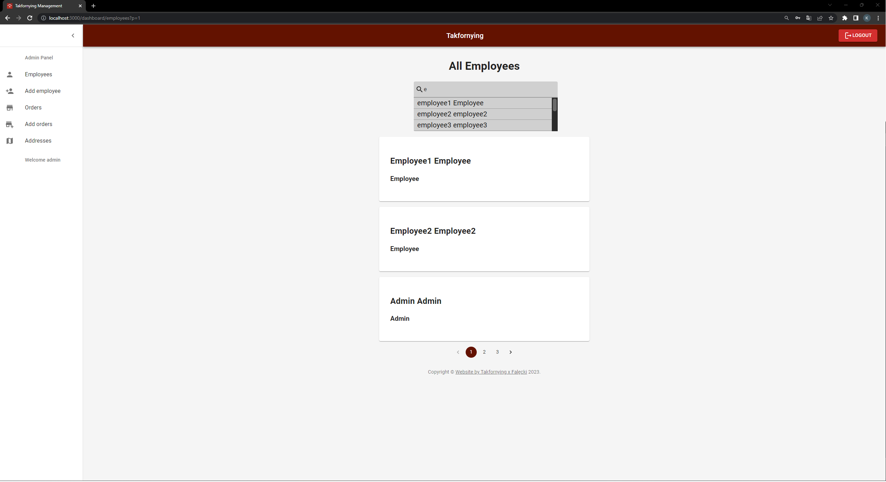
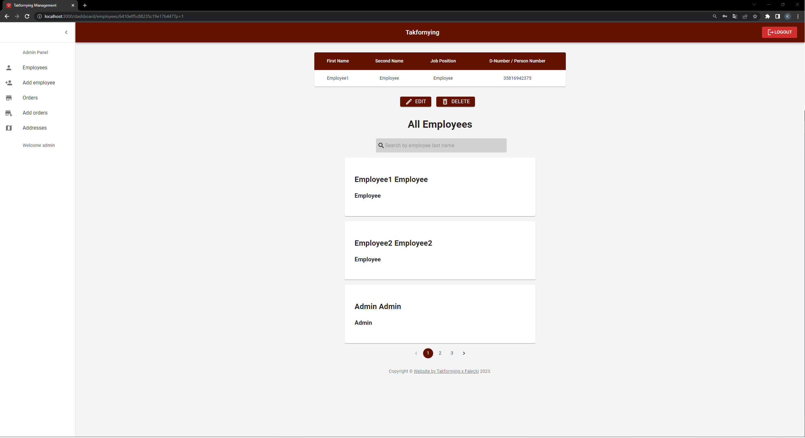
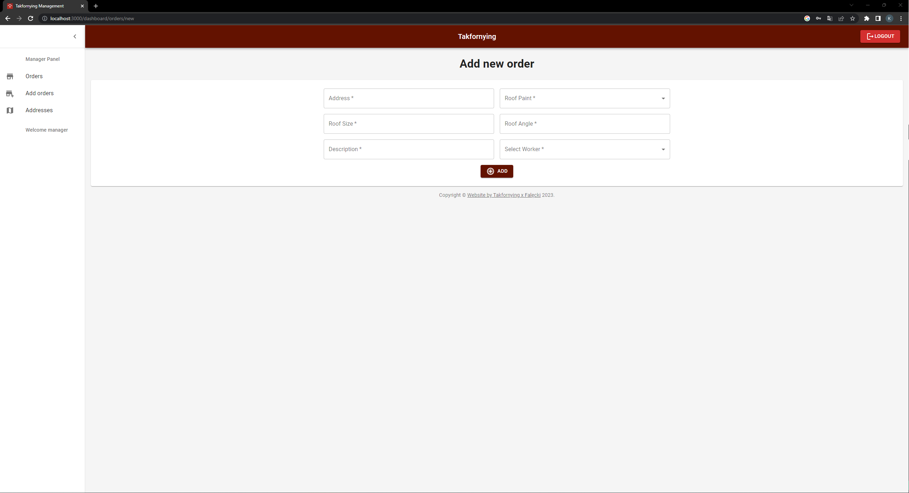
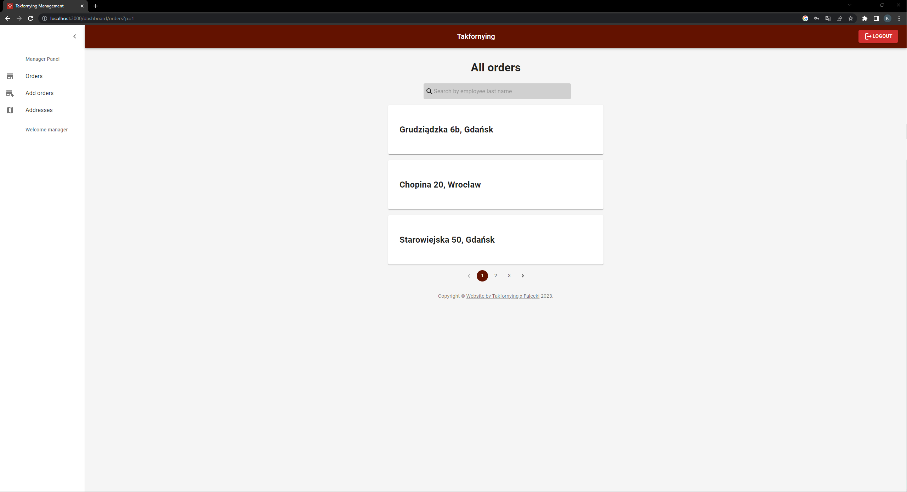
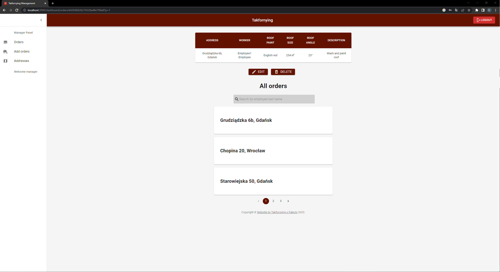
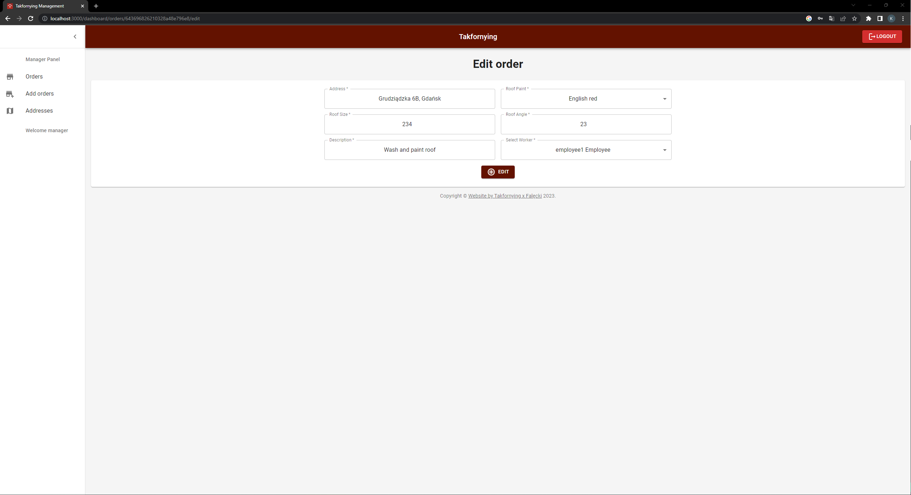
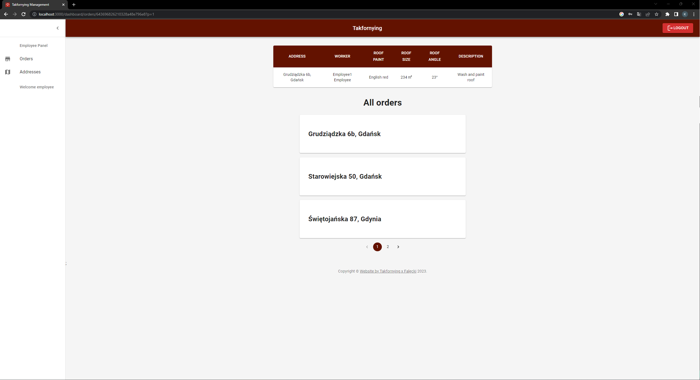
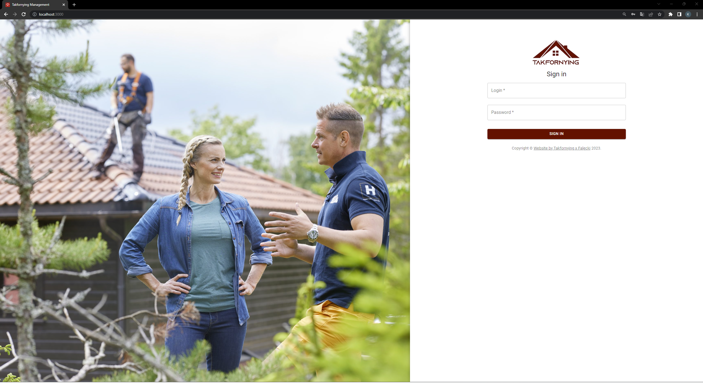
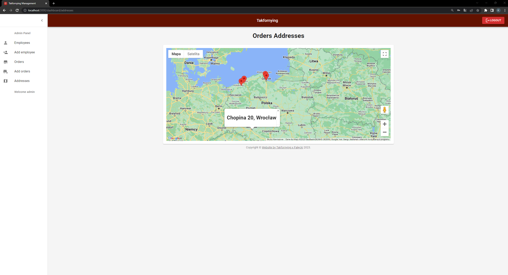

# Takfornying - Management Web Application
## Summary
Takfornying - Management Web Application is a simple management application that allows boss and manager to search, managment of orders or employee. Employee account only have permission to read information about orders. The application also features a robust Content Management System (CMS) for authorized users, allowing them to easily modify, add, and delete products and employee accounts.

## Features
* User authentication and authorization for secure access to the application
* Users database for registered users, allowing them to easily manage their orders and employees.
* Content Management System for creating and editing content, making it easy for non-technical users to contribute to the website
* Order management and employee management for admin/owner company.
* Users seeding with assigned roles for quick setup and role-based access control
* Unit Tests to ensure that critical features function as intended

## Technologies Used
* Front-end: HTML, CSS, JavaScript, React, Redux
* Back-end: JavasSript, Node.js, Express.js
* Back-end Repository: https://github.com/LilWebDeveloper/Backend-TakfornyingApp
* Database: MongoDB
* Authentication and Authorization: JSON Web Tokens

## Future Enhancements
* Implementing function to add pictures to orders information.
* Enhancing the front-end design with modern UI/UX trends
* Implementing function to comfirm end of work.

# Images

## Admin has Manager Pages + Employee Pages and the below Admin Pages

### Employee Add Page

### Employee Search Page

### Employee Detail Page

### Employee Edit Page

## Manager has Employee Pages and the bellow Manager Pages

### Orders Add Page

### Orders Search Page

### Orders Detail Page

### Orders Edit Page

## Employee Page

### Orders with details page

## Every users has this pages

### Login Page

### Google Map Page

