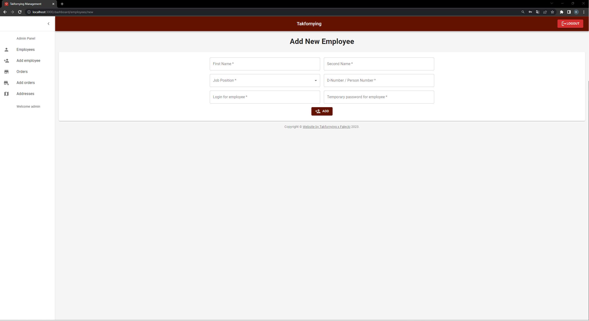

# Takfornying - Management Web Application
## Summary
Takfornying - Management Web Application is a user-friendly app designed to simplify management tasks for bosses and managers. With this app, you can easily search and manage orders and employees. The application provides different levels of access, ensuring that employees can only view order information, while authorized users have full control.

## Key Features
* Secure User Authentication and Authorization: Safely access the application with personalized accounts and manage permissions based on user roles.
* Users Database: Easily manage orders and employees, keeping all essential information in one centralized location.
* Content Management System (CMS): Update and modify content effortlessly, even without technical expertise, thanks to the intuitive CMS.
* Order and Employee Management: Efficiently handle all aspects of orders and employee information, streamlining operations for business owners.
* Quick Setup with Role-Based Access Control: Set up user accounts with pre-defined roles, saving time and ensuring the right level of access for each user.
* Reliable Testing: The application includes unit tests to verify that critical features are functioning correctly.

## Technologies Used
* Front-end: HTML, CSS, JavaScript, React, Redux
* Back-end: JavaScript, Node.js, Express.js
* Database: MongoDB
* Authentication and Authorization: JSON Web Tokens

## Future Enhancements
The app has plans for further improvements, including the ability to add pictures to order information, enhancing the front-end design with modern UI/UX trends, and implementing a function to confirm the end of work.
##
To learn more about the app and explore its backend repository, visit: https://github.com/LilWebDeveloper/Backend-TakfornyingApp

With Takfornying - Management Web Application, you can efficiently manage your orders and employees, ensuring smooth operations and improved productivity.

# Images

## Admin has Manager Pages + Employee Pages and the below Admin Pages

### Employee Add Page

### Employee Search Page

### Employee Detail Page

### Employee Edit Page

## Manager has Employee Pages and the bellow Manager Pages

### Orders Add Page

### Orders Search Page

### Orders Detail Page

### Orders Edit Page

## Employee Page

### Orders with details page

## Every users has this pages

### Login Page

### Google Map Page

